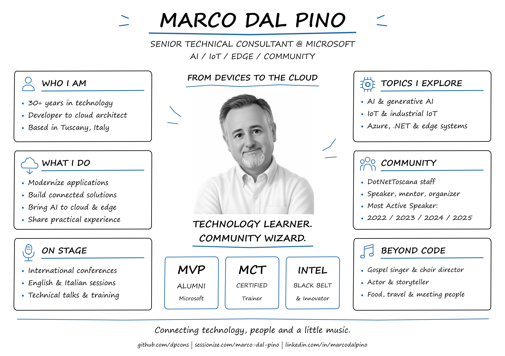

# Marco Dal Pino

**Senior Technical Consultant at Microsoft · AI, IoT & Edge · Speaker & community enthusiast**

[About me](#about-me) · [GitHub Stats](#github-stats) · [Topics](#what-i-work-on-and-talk-about) · [Community](#community-and-recognition) · [Links](#connect-and-explore) · [Sessions](#technical-sessions)

## About me

I'm Marco, a **Senior Technical Consultant at Microsoft** helping customers modernize their applications and move to the cloud.

Over **30 years in IT**, I've worked as a developer, team leader, project manager and cloud architect. My background spans **.NET, business applications, desktop, mobile and embedded systems**. Today, my main interests meet where **AI, IoT and the edge** come together.

I'm a **Microsoft Certified Trainer** and an international speaker. I enjoy sharing practical experience, learning with other developers and contributing to technical communities as a speaker, mentor and organizer.

Away from the keyboard, I love food, travel and meeting people. I'm also a **gospel singer, choir director and actor**. Whether it's a technical session or a stage performance, I enjoy connecting with an audience.

## GitHub Stats

  
   
  

Statistics and trophies are generated by external services from public GitHub activity and may be cached or temporarily unavailable.

## What I work on and talk about

| Area | Topics |
| --- | --- |
| **AI & generative AI** | Prompt engineering, intelligent applications and bringing AI into existing solutions. |
| **IoT & industrial IoT** | Connected devices, embedded systems, telemetry and Azure IoT. |
| **Edge & cloud** | Edge AI, hybrid solutions and application modernization on Azure. |
| **Development** | .NET, Windows applications and the journey from devices to cloud services. |

My [Sessionize profile](https://sessionize.com/marco-dal-pino/) includes session abstracts and language availability in **English and Italian**.

## Community and recognition

- **DotNetToscana** community staff member.
- **Microsoft MVP Alumni** and **Microsoft Certified Trainer**.
- **Intel Black Belt & Innovator**.
- Past recognition as **Nokia Developer Champion** and **Hackster Live Ambassador**.
- Sessionize **Most Active Speaker** badges for **2022, 2023, 2024 and 2025**.

## Connect and explore

| Find me | Explore my work |
| --- | --- |
| [LinkedIn — professional profile and updates](https://www.linkedin.com/in/marcodalpino/) | [Sessionize — speaker bio and session catalog](https://sessionize.com/marco-dal-pino/) |
| [GitHub — projects and code](https://github.com/dpcons) | [Session materials](Decks/) · [Event archive](TechSessions/) |

About the infographic

An original sketchnote-style overview of my work, community involvement and interests.
The profile illustration comes from my public Sessionize profile.
The bio and highlights are based on my LinkedIn and Sessionize profiles and this repository, reviewed in October 2026.

[Full-size image](Resources/Images/marco-dal-pino-profile.png) · [Vector version](Resources/Images/marco-dal-pino-profile.svg) · [Editable Excalidraw source](Resources/Images/marco-dal-pino-profile.excalidraw)

---

## Technical sessions

Events recorded in this repository, most recent first. The archive is updated over time; it is not a complete list of all my speaking engagements.
Only months with recorded events are shown. Entries without a linked page are marked *session details not yet published*.

Events before 2026 are collected in separate annual pages, grouped by month.

[2026](#2026) · [Earlier years](#earlier-years)

### 2026
#### May
[🗣️ 29/5/2026 - Tabyaconf 26- Taggia](TechSessions/202600529-TabyaConf26.md)

[🗣️ 16/5/2026 - L’Aquila Software Tech Forum - L'aquila](TechSessions/20260516-TechForum26.md)

[🗣️ 02/05/2026 - East of England Power Platform Summit - Norwich (UK)](TechSessions/20260502-EOEPPS26.md)

#### April
[🗣️ 18/4/2026 - GlobalAzure - Pordenone 26](TechSessions/20260418-GAPN26.md)

[🗣️ 17/4/2026 - GlobalAzure - Bari 26](TechSessions/20260417-GABA26.md)

[🗣️ 13/4/2026 - GlobalAzure - Milano 26](TechSessions/20260413-GAMI26.md)

#### March
[🗣️ 07/03/2026 - Data Sat Romania - Timisoara](TechSessions/20260307-DataSatTimi26.md)

#### February
[🗣️ 28/2/2026 - DataSat - Pordenone 26](TechSessions/20260228-DataSatPN26.md)

#### January
🗣️ 31/1/2026 - DotNetSat - Pordenone — *session details not yet published*

🗣️ 23-24/1/2026 - CollabDays - Bremen — *session details not yet published*

### Earlier years

- [🗣️ 2025 Events (16)](TechSessions/2025YearSummary.md)
- [🗣️ 2024 Events (14)](TechSessions/2024YearSummary.md)
- [🗣️ 2023 Events (13)](TechSessions/2023YearSummary.md)
- [🗣️ 2022 Events (17)](TechSessions/2022YearSummary.md)
- [🗣️ 2021 Events (11)](TechSessions/2021YearSummary.md)
- [🗣️ 2020 Events (10)](TechSessions/2020YearSummary.md)
- [🗣️ 2019 Events (20)](TechSessions/2019YearSummary.md)
- [🗣️ 2018 Events (22)](TechSessions/2018YearSummary.md)
- [🗣️ 2017 Events (20)](TechSessions/2017YearSummary.md)
- [🗣️ 2016 Events (24)](TechSessions/2016YearSummary.md)
- [🗣️ 2015 Events (24)](TechSessions/2015YearSummary.md)
- [🗣️ 2014 Events (14)](TechSessions/2014YearSummary.md)
- [🗣️ 2013 Events (13)](TechSessions/2013YearSummary.md)
